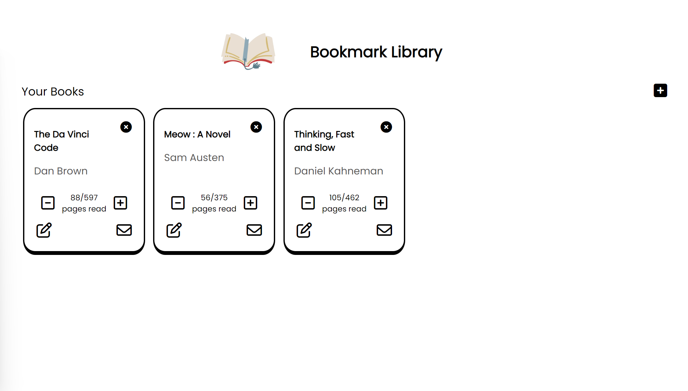

# Bookmark Library

## Check out the live preview [here](https://sushibanana.github.io/Book-Library/)
## **Have you ever lost track on what page you last read till? Well, fear no more as this bookmark library will keep track of _what books you've read_ and _the page you last read_.**

### Features
- straightforward dialog interface to add new books
- edit button for easy modification of book details
- easily mark book as read with one click
- increment and decrement pages read
- quick deletion of added books

## Key takeaways
### This project definitely took much more time than anticipated. There are many things to take into considertion. For example:
- creating similar variables for DOM manipulation to ensure input data from `dialog` was accurately captured and utilized despite redundancy
- implementing event delegation i.e: adding event listeners on the `books container` instead of each individual button, as the buttons are not in the HTML initially

### Overall, I throughly enjoyed this project becuase I finally got to experiment with Object Oriented Programming (OOP) in JavaScript